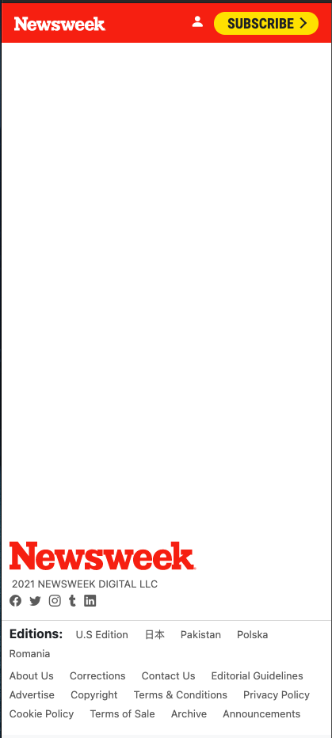
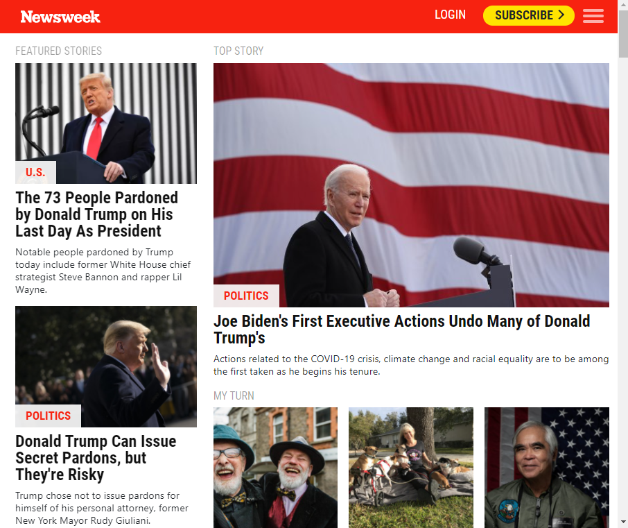
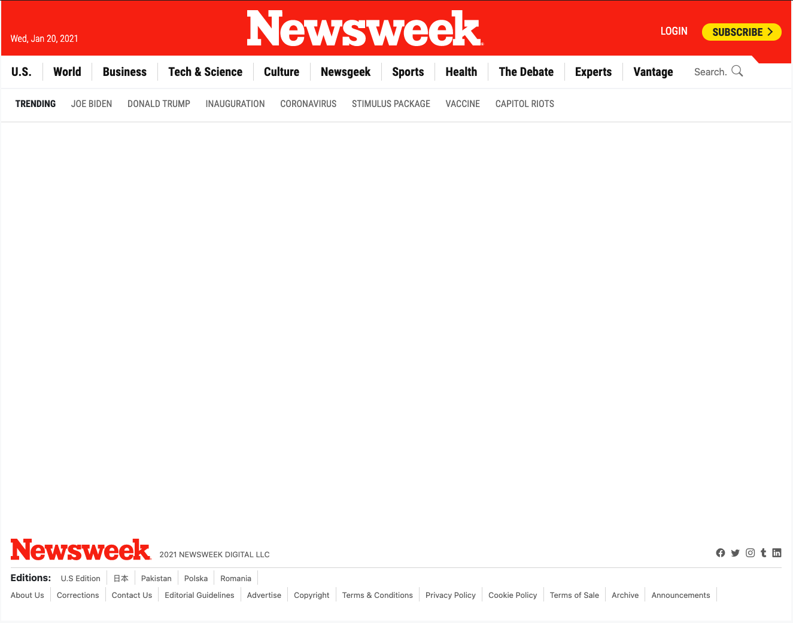

# News_Week_Clone

A Clone of a News Week page using Bootsrap

## Built With

- HTML
- SCSS
- Bootstrap

## Live Demo

[Live Demo Link](https://crappypapa.github.io/News_Week_Clone/)

## Getting Started

No prerequisites
To get a local copy up and running:

1) Clone the repo or download the Zip folder
2) Run live server or simply open the index.html file with a browser
## Authors

👤 **Author1**

- GitHub: [@crappypapa](https://github.com/crappypapa)

👤 **Author2**

- GitHub: [@marijanbrvar](https://github.com/marijanbrvar)

## 🤝 Contributing

Contributions, issues, and feature requests are welcome!

## Show your support

Give a ⭐️ if you like this project!

## 📝 License

This project is [MIT](lic.url) licensed.
